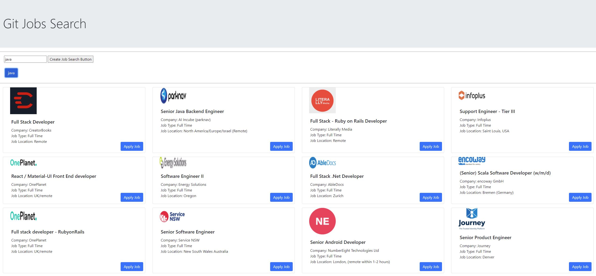

# api_gitJobs_withCustomizedProxy

1. execute proxy server
   - ~~proxy/node . (this starts the proxy server)~~
   - ~~listening to localhost port 3000~~
   - proxy server is runing on Heroku now
2. lunch this web app
   - index.html
   - type tech search term, like "java", "python" ...

